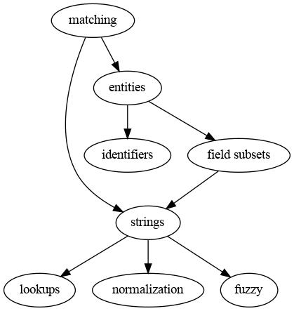

# fuzzycat (wip)

Fuzzy matching publications for [fatcat](https://fatcat.wiki).

* [fuzzycat](https://pypi.org/project/fuzzycat/)

Note: This is currently work-in-progress.

## Motivation

Most of the results on sites like [Google
Scholar](https://scholar.google.com/scholar?q=fuzzy+matching) group
publications into clusters. Each cluster represents one publication, abstracted
from its concrete representation as a link to a PDF.

We call the abstract publication
[work](https://guide.fatcat.wiki/entity_work.html) and the concrete instance a
[release](https://guide.fatcat.wiki/entity_release.html). One goal is to group
releases under works and to implement a versions feature (self-match). Another
goal is to have support for matching of external lists (e.g. title lists or
other document) to the existing records.

This repository contains both generic code for matching as well as fatcat
specific code using the fatcat openapi client.

## Running and Deployment

We defer more packaging polish until the code stabilizes a bit more. For now:

```
$ git clone git@github.com:miku/fuzzycat.git && cd fuzzycat
$ pipenv install --deploy
$ pipenv run python -m fuzzycat.main
```

For the future, an independent [pex](https://github.com/pantsbuild/pex) or
[shiv](https://github.com/linkedin/shiv) executable would be a convenient
option to allow execution from any directory.

## Approach

* Local code, with command line entry points for matching as well as adapter
  for fatcat.

A few assumption we need to make:

* If two strings are given, an exact string match does not mean equality (at
  all), e.g.  "Acta geographica" has currently eight associated ISSN, and a
title like "Buchbesprechungen" appears many hundreds of times. We need a bit
more context for a decision.

## Datasets

Relevant datasets are:

* release and container metadata from a bulk fatcat export, e.g. [https://archive.org/details/fatcat_bulk_exports_2020-08-05](https://archive.org/details/fatcat_bulk_exports_2020-08-05)
* issn journal level data, via [issnlister](https://github.com/miku/issnlister)
* journal abbreviation lists

## Matching approaches



## Performance data points

### Against elasticsearch

Candidate generation via elasticsearch, 40 parallel queries, sustained speed at
about 17857 queries per hour, that is around 5 queries/s.

```
$ time cat ~/data/researchgate/x04 | \
    parallel -j40 --pipe -N 1 ./fatcatx_rg_unmatched.py - \
    > ~/data/researchgate/x04_results.ndj
...
real    3409m16.442s
user    29177m5.516s
sys     4927m3.277s
```

### Without a search index

Candidate grouping for self-match can be done locally by extracting a key per
document, then a group by (via sort and uniq). Clustering 150M docs took about
607min (around 4k docs/s, no verification step).

## Data issues

### A republished article

* [https://fatcat.wiki/release/search?q=%22The+doctor+with+seven+billion+patients%22](https://fatcat.wiki/release/search?q=%22The+doctor+with+seven+billion+patients%22)

There is "student BMJ" and "BMJ" - this (html) article (interview) has been
first published on "sbmj" (Published 07 July 2011), then "bmj" (Published 10
August 2011).

> Notes; Originally published as: Student BMJ 2011;19:d3983

* https://www.bmj.com/content/343/sbmj.d3983
* https://www.bmj.com/content/343/bmj.d4964

It is essentially the same text, same title, author, just different DOI and
probably a different recorded date.

Generic pattern "republication" duplicate:

* metadata mostly same, except date and doi

### Common title

Probably a few thousand very common short titles.

* [https://fatcat.wiki/release/search?q=%22Book+Reviews%22](https://fatcat.wiki/release/search?q=%22Book+Reviews%22) (238852)

Some authors do this regularly:

* [https://fatcat.wiki/release/search?q=%22Book+Reviews%22+%22william%22+%22michael%22](https://fatcat.wiki/release/search?q=%22Book+Reviews%22+%22william%22+%22michael%22) (398)

Different DOI, so we know it is different.

More examples:

* [https://fatcat.wiki/release/search?q=%22errata%22](https://fatcat.wiki/release/search?q=%22errata%22) (37680)
* [https://fatcat.wiki/release/search?q=%22Einleitung%22](https://fatcat.wiki/release/search?q=%22Einleitung%22) (68005)
* [https://fatcat.wiki/release/search?q=%22Notes%22](https://fatcat.wiki/release/search?q=%22Notes%22) (1507705)
* [https://fatcat.wiki/release/search?q=%22Letters+to+the+Editor%22](https://fatcat.wiki/release/search?q=%22Letters+to+the+Editor%22) (30976)

### Title with extra data

* like ISBN, ISSN, price and all kind of extra metadata
* [https://fatcat.wiki/release/search?q=title%3A%22ISBN%22](https://fatcat.wiki/release/search?q=title%3A%22ISBN%22)
* titles typically get longer: [https://fatcat.wiki/release/olxswrilxfci3ibb3bg5xhstr4](https://fatcat.wiki/release/olxswrilxfci3ibb3bg5xhstr4)
* some of these are actually "reviews", e.g. [https://fatcat.wiki/release/4blc5mfc5bfaxkofuletqxuzp4](https://fatcat.wiki/release/4blc5mfc5bfaxkofuletqxuzp4)

Another example:

* too [long](https://fatcat.wiki/release/hewmq4afvnew7pwttvulzguubu), original suggested citation seems to be:

> Parker, S. and Kerrod, R. (2002), "Children’s) Space Busters (1st) Looking at Stars (2nd)", Reference Reviews, Vol. 16 No. 5, pp. 26-27. https://doi.org/10.1108/rr.2002.16.5.26.252

### Sometimes a title will be ambiguous

For example given a title "Shakespeare in Tokyo" we would have to always return "ambiguous", as there are at least two separate publication with that name:

* [https://fatcat.wiki/release/search?q=%22Shakespeare+in+Tokyo%22](https://fatcat.wiki/release/search?q=%22Shakespeare+in+Tokyo%22)

This is similar to journal names, where some journal names will always be ambiguous.

### Versions

* same title, same authors, "vX" doi
* [https://fatcat.wiki/release/search?q=%22Self-similarity+analysis+of+the+non-linear%22](https://fatcat.wiki/release/search?q=%22Self-similarity+analysis+of+the+non-linear%22)

Sometimes, we have a couple of preprint versions, plus a published version (with a slightly different title):

* [https://fatcat.wiki/release/search?q=%22Time-periodic+solutions+of+massive%22](https://fatcat.wiki/release/search?q=%22Time-periodic+solutions+of+massive%22)

### Almost same

* same author, maybe year
* different DOI
* title almost the same, e.g. [MassIVE MSV000085583 - Aedes aegypti protein profile and proteome analysis](https://fatcat.wiki/release/search?q=%22Aedes+aegypti+protein+profile+and+proteome+analysis%22)

### Duplication by different granularity

* [https://fatcat.wiki/release/search?q=%22Volkshochschule+Leipzig%22](https://fatcat.wiki/release/search?q=%22Volkshochschule+Leipzig%22) (20308)
* contains both yearly entries, as well as "DOI per page",
  [https://fatcat.wiki/release/r734v367nza4tl37j6d74rfqo4](https://fatcat.wiki/release/r734v367nza4tl37j6d74rfqo4);
could group pages under "container" of yearly release?
* We have [one container](https://github.com/internetarchive/fatcat/blob/4f80b87722d64f27c985f0040ea177269b6e028b/fatcat-openapi2.yml#L704-L709) per release, currently.

### Partial titles

A metadata title might differ from the full title.

* [https://fatcat.wiki/release/search?q=%22Brain-derived+neurotrophic+factor%22](https://fatcat.wiki/release/search?q=%22Brain-derived+neurotrophic+factor%22)

Here, the [release](https://fatcat.wiki/release/2vi655gcejffhnzzbkkcnjpscm) points to two PDFs, one is an article, the other a weekly report (summary).

### Exact duplicates

* [https://fatcat.wiki/release/search?q=%22WEIGHTED+LIPSCHITZ+ESTIMATES+FOR+COMMUTATORS+ON+WEIGHTED+MORREY-HERZ+SPACES%22](https://fatcat.wiki/release/search?q=%22WEIGHTED+LIPSCHITZ+ESTIMATES+FOR+COMMUTATORS+ON+WEIGHTED+MORREY-HERZ+SPACES%22)

### Difference in Subtitle (invisible)

Subtitle is not visible metadata, all same, except for the DOI and the page number. Different.

* [https://fatcat.wiki/release/search?q=%22Slip+in+tungsten+monocarbide%22](https://fatcat.wiki/release/search?q=%22Slip+in+tungsten+monocarbide%22)

### The "what a difference a char makes" case

Typically a yearly report, or "part 1", "part 2", like this:

* [https://fatcat.wiki/release/search?q=%22The+Use+of+Bone+Age+in+Clinical+Practice+%22](https://fatcat.wiki/release/search?q=%22The+Use+of+Bone+Age+in+Clinical+Practice+%22)

DOI differs and could hard code some patterns.

### Published to two sites

An article can have multiple DOI, e.g. when republished by a site that gives out DOI, e.g. researchgate. Example:

* [Effect of Chlorophyll and Anthocyanin on the Secondary Bonds of Poly Vinyl Chloride](https://fatcat.wiki/release/search?q=%22Effect+of+Chlorophyll+and+Anthocyanin+on+the+Secondary+Bonds+of+Poly+Vinyl+Chloride+%22)

> https://doi.org/10.11648/j.ijmsa.s.2015040201.15, https://doi.org/10.13140/rg.2.1.2398.3606

Probably many "10.13140" prefixed DOI has at least another DOI.

Some might be "rg-only", like this: [https://fatcat.wiki/release/search?q=%22Marco+de+trabajo+basado+en+los+datos+enlazados+para%22](https://fatcat.wiki/release/search?q=%22Marco+de+trabajo+basado+en+los+datos+enlazados+para%22)
