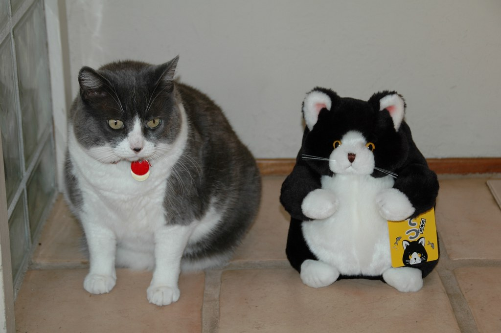

<div align="center">
<!-- Photo is CC BY 2.0 by Chika Watanabe from flickr -->
<a href="https://www.flickr.com/photos/chikawatanabe/192112067">

</a>
</div>

`fuzzycat`: bibliographic fuzzy matching for fatcat.wiki
========================================================


This Python library contains routines for finding near-duplicate bibliographic
entities (primarily research papers), and estimating whether two metadata
records describe the same work (or variations of the same work). Some routines
are designed to work "offline" with batches of billions of sorted metadata
records, and others are designed to work "online" making queries against hosted
web services and catalogs.

`fuzzycat` was originally developed by Martin Czygan at the Internet Archive,
and is used in the construction of a citation graph and to identify duplicate
records in the [fatcat.wiki](https://fatcat.wiki) catalog and
[scholar.archive.org](https://scholar.archive.org) search index.

**DISCLAIMER:** this tool is still under development, as indicated by the "0"
major version. The interface, semantics, and behavior are likely to be tweaked.


## Quickstart

Inside a `virtualenv` (or similar), install with [pip](https://pypi.org/project/pip/):

```
pip install fuzzycat
```

The `fuzzycat.simple` module contains high-level helpers which query Internet
Archive hosted services:

    import elasticsearch
    from fuzzycat.simple import *

    es_client = elasticsearch.Elasticsearch("https://search.fatcat.wiki:443")

    # parses reference using GROBID (at https://grobid.qa.fatcat.wiki),
    # then queries Elasticsearch (at https://search.fatcat.wiki),
    # then scores candidates against latest catalog record fetched from
    #  https://api.fatcat.wiki
    best_match = closest_fuzzy_unstructured_match(
        """Cunningham HB, Weis JJ, Taveras LR, Huerta S. Mesh migration following abdominal hernia repair: a comprehensive review. Hernia. 2019 Apr;23(2):235-243. doi: 10.1007/s10029-019-01898-9. Epub 2019 Jan 30. PMID: 30701369.""",
        es_client=es_client)

    print(best_match)
    # FuzzyReleaseMatchResult(status=<Status.EXACT: 'exact'>, reason=<Reason.DOI: 'doi'>, release={...})

    # same as above, but without the GROBID parsing, and returns multiple results
    matches = close_fuzzy_biblio_matches(
        dict(
            title="Mesh migration following abdominal hernia repair: a comprehensive review",
            first_author="Cunningham",
            year=2019,
            journal="Hernia",
        ),
        es_client=es_client,
    )

A CLI tool is included for processing records in UNIX stdin/stdout pipelines:

    # print usage
    python -m fuzzycat


## Features and Use-Cases

The **`cgraph`** system builds on top of this library to build a citation graph
by processing billions of structured and unstructured reference records
extracted from scholarly papers.

Automated imports of metadata records into the fatcat catalog use fuzzycat to
filter new metadata which look like duplicates of existing records from other
sources.

In conjunction with standard command-line tools (like `sort`), fatcat bulk
metadata snapshots can be clustered and reduced into groups to flag duplicate
records for merging.

Extracted reference strings from any source (webpages, books, papers, wikis,
databases, etc) can be resolved against the fatcat catalog of scholarly papers.


## Support and Acknowledgements

Work on this software received support from the Andrew W. Mellon Foundation
through multiple phases of the ["Ensuring the Persistent Access of Open Access
Journal Literature"](https://mellon.org/grants/grants-database/advanced-search/?amount-low=&amount-high=&year-start=&year-end=&city=&state=&country=&q=%22Ensuring+the+Persistent+Access%22&per_page=25) project (see [original announcement](http://blog.archive.org/2018/03/05/andrew-w-mellon-foundation-awards-grant-to-the-internet-archive-for-long-tail-journal-preservation/)).

Additional acknowledgements [at fatcat.wiki](https://fatcat.wiki/about).
