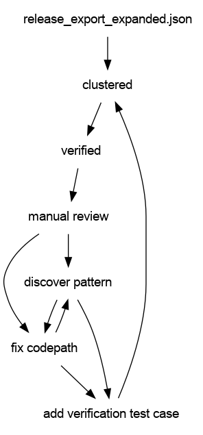

# fuzzycat (wip)

Fuzzy matching utilities for [fatcat](https://fatcat.wiki).


To install with [pip](https://pypi.org/project/pip/), run:

```
$ pip install fuzzycat
```

## Overview

The fuzzycat library currently works on [fatcat database release
dumps](https://archive.org/details/fatcat_snapshots_and_exports?&sort=-publicdate)
and can cluster similar release items, that is it can find clusters and can
verify match candidates.

For example we can identify:

* versions of various items (arxiv, figshare, datacite, ...)
* preprint and published pairs
* similar items from different sources

## TODO

* [ ] take a list of title strings and return match candidates (faster than
  elasticsearch); e.g. derive a key and find similar keys some cached clusters
* [ ] take a list of title, author documents and return match candidates; e.g.
  key may depend on title only, but verification can be more precise
* [ ] take a more complete, yet partial document and return match candidates

For this to work, we will need to have cluster from fatcat precomputed and
cache. We also might want to have it sorted by key (which is a side effect of
clustering) so we can binary search into the cluster file for the above todo
items.

## Dataset

For development, we worked on a `release_export_expanded.json` dump (113G/700G
zstd/plain, 154203375 lines) and with the [fatcat
API](https://api.fatcat.wiki/).

The development workflow looked something like the following.



## Clustering

Clustering derives sets of similar documents from a [fatcat database release
dump](https://archive.org/details/fatcat_snapshots_and_exports?&sort=-publicdate).

Following algorithms are implemented (or planned):

* [x] exact title matches (title)
* [x] normalized title matches (tnorm)
* [x] NYSIIS encoded title matches (tnysi)
* [x] extended title normalization (tsandcrawler)

Example running clustering:

```
$ python -m fuzzycat cluster -t tsandcrawler < data/re.json > cluster.json.zst
```

Clustering works in a three step process:

1. key extraction for each document (choose algorithm)
2. sorting by keys (via [GNU sort](https://www.gnu.org/software/coreutils/manual/html_node/sort-invocation.html))
3. group by key and write out ([itertools.groupby](https://docs.python.org/3/library/itertools.html#itertools.groupby))

## Verification

Run verification (pairwise *double-check* of match candidates in a cluster).

```
$ time zstdcat -T0 sample_cluster.json.zst | python -m fuzzycat verify > sample_verify.txt

real    7m56.713s
user    8m50.703s
sys     0m29.262s
```

This is a one-pass operation. For processing 150M docs, we very much depend on
the documents being on disk in a file (we keep the complete document in the
clustering result).

Example results:

```
3450874 Status.EXACT Reason.TITLE_AUTHOR_MATCH
2619990 Status.STRONG Reason.SLUG_TITLE_AUTHOR_MATCH
2487633 Status.DIFFERENT Reason.YEAR
2434532 Status.EXACT Reason.WORK_ID
2085006 Status.DIFFERENT Reason.CONTRIB_INTERSECTION_EMPTY
1397420 Status.DIFFERENT Reason.SHARED_DOI_PREFIX
1355852 Status.DIFFERENT Reason.RELEASE_TYPE
1290162 Status.AMBIGUOUS Reason.DUMMY
1145511 Status.DIFFERENT Reason.BOOK_CHAPTER
1009657 Status.DIFFERENT Reason.DATASET_DOI
 996503 Status.STRONG Reason.PMID_DOI_PAIR
 868951 Status.EXACT Reason.DATACITE_VERSION
 796216 Status.STRONG Reason.DATACITE_RELATED_ID
 704154 Status.STRONG Reason.FIGSHARE_VERSION
 534963 Status.STRONG Reason.VERSIONED_DOI
 343310 Status.STRONG Reason.TOKENIZED_AUTHORS
 334974 Status.STRONG Reason.JACCARD_AUTHORS
 293835 Status.STRONG Reason.PREPRINT_PUBLISHED
 269366 Status.DIFFERENT Reason.COMPONENT
 263626 Status.DIFFERENT Reason.SUBTITLE
 224021 Status.AMBIGUOUS Reason.SHORT_TITLE
 152990 Status.DIFFERENT Reason.PAGE_COUNT
 133811 Status.AMBIGUOUS Reason.CUSTOM_PREFIX_10_5860_CHOICE_REVIEW
 122600 Status.AMBIGUOUS Reason.CUSTOM_PREFIX_10_7916
  79664 Status.STRONG Reason.CUSTOM_IEEE_ARXIV
  46649 Status.DIFFERENT Reason.CUSTOM_PREFIX_10_14288
  39797 Status.DIFFERENT Reason.JSTOR_ID
  38598 Status.STRONG Reason.CUSTOM_BSI_UNDATED
  18907 Status.STRONG Reason.CUSTOM_BSI_SUBDOC
  15465 Status.EXACT Reason.DOI
  13393 Status.DIFFERENT Reason.CUSTOM_IOP_MA_PATTERN
  10378 Status.DIFFERENT Reason.CONTAINER
   3081 Status.AMBIGUOUS Reason.BLACKLISTED
   2504 Status.AMBIGUOUS Reason.BLACKLISTED_FRAGMENT
   1273 Status.AMBIGUOUS Reason.APPENDIX
   1063 Status.DIFFERENT Reason.TITLE_FILENAME
    104 Status.DIFFERENT Reason.NUM_DIFF
      4 Status.STRONG Reason.ARXIV_VERSION
```

## A full run

Single threaded, 42h.

```
$ time zstdcat -T0 release_export_expanded.json.zst | \
    TMPDIR=/bigger/tmp python -m fuzzycat cluster --tmpdir /bigger/tmp -t tsandcrawler | \
    zstd -c9 > cluster_tsandcrawler.json.zst
{
  "key_fail": 0,
  "key_ok": 154202433,
  "key_empty": 942,
  "key_denylist": 0,
  "num_clusters": 124321361
}

real    2559m7.880s
user    2605m41.347s
sys     118m38.141s
```

So, 29881072 (about 20%) docs in the potentially duplicated set. Verification (about 15h w/o parallel):

```
$ time zstdcat -T0 cluster_tsandcrawler.json.zst | python -m fuzzycat verify | \
    zstd -c9 > cluster_tsandcrawler_verified_3c7378.tsv.zst

...

real    927m28.631s
user    939m32.761s
sys     36m47.602s
```

----

# Misc

## Use cases

* [ ] take a release entity database dump as JSON lines and cluster releases
  (according to various algorithms)
* [ ] take cluster information and run a verification step (misc algorithms)
* [ ] create a dataset that contains grouping of releases under works
* [ ] command line tools to generate cache keys, e.g. to match reference
  strings to release titles (this needs some transparent setup, e.g. filling of
a cache before ops)

## Usage

Release clusters start with release entities json lines.

```shell
$ cat data/sample.json | python -m fuzzycat cluster -t title > out.json
```

Clustering 1M records (single core) takes about 64s (15K docs/s).

```shell
$ head -1 out.json
{
  "k": "裏表紙",
  "v": [
    ...
  ]
}
```

Using GNU parallel to make it faster.

```
$ cat data/sample.json | parallel -j 8 --pipe --roundrobin python -m fuzzycat.main cluster -t title
```

Interestingly, the parallel variants detects fewer clusters (because data is
split and clusters are searched within each batch). TODO(miku): sort out sharding bug.
