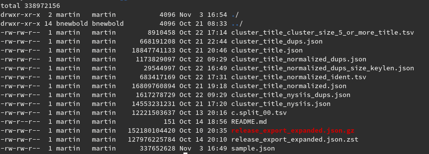

# Extra code and docs

Rough notes on applications.

## Reproducibility

Projects end up with a data folder, that is hard to reproduce.

What you need to know:

* commands invoked
* their order and dependencies

We want to run N cluster algorithms and maybe for each of them run M
verification algorithms, so in the end, we can evaluate approaches against well
specified examples (test cases).

# Reading

* [FAIR Computational Workflows](https://www.mitpressjournals.org/doi/pdf/10.1162/dint_a_00033)

> Computational workflows describe the complex multi-step methods that are used
> for data collection, data preparation,  analytics,  predictive  modelling,
> and  simulation  that  lead  to  new  data  products.

* [Sustainable data analysis](https://zenodo.org/record/4240139)
